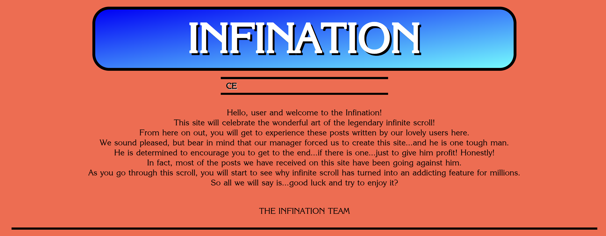
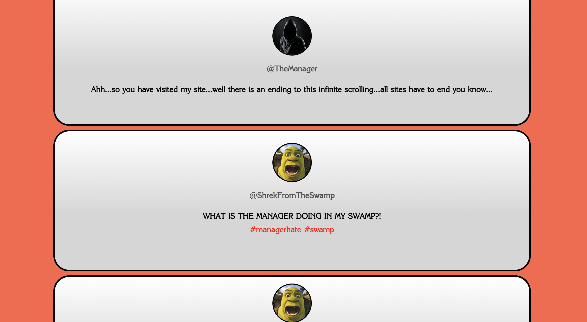
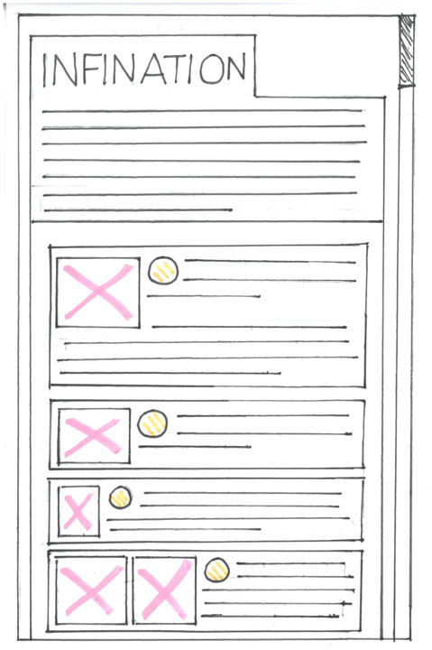
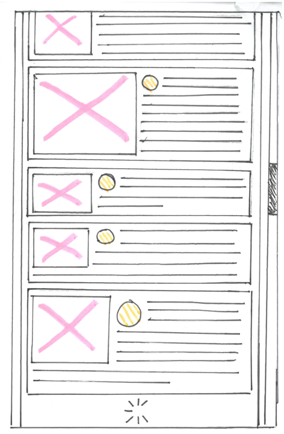

# Infination Prototype README File

Code is evolved from this example: 
[https://codepen.io/tutsplus/pen/gOeYKwE](https://codepen.io/tutsplus/pen/gOeYKwE).

# Infination Screenshots

# Initial Wireframe Designs 

# Project Overview
The project is a user experience based on the infinite scrolling mechanic. In this case, there will be multiple posts featuring many characters that posts something related to them. However, there is also a manager, guaranteed to appear from time to time. He plans on encouraging the user to keep scrolling until addicted so he can make the profit. Many of the characters posts even criticise the manager for his actions and go against him.

# Aim
The aim is to show that engagement with this function can be taken too far. From this, people can scroll for a while and find a promising search, only to be led towards somewhere else on the web, possibly someplace predatory. It also aims to show how people should not waste their time constantly scrolling since the results become less relevant, especially for those looking for something specific, leading this mechanic to become more of an addiction.

# Interactions
Some posts will feature videos the user can play on the site.

# Aesthetics
The site's background is red tomato coloured and the card containers are coloured in white-grey gradients. Furthermore, the underneath the logo features a marquee, referencing the infinite scroll. The hashtags are also in red, along with the ITC Korinna font used throughout.

# What Will I Do Next Tune
While I have definitely met the requirements I planned to meet, I do think there is some slight room for improvement. If I had more time on this project, I would have probably created a white background that sits behind the card containers that also has an infinite height script. I would have also liked to have done a bit more research into the theory of infinite scroll.